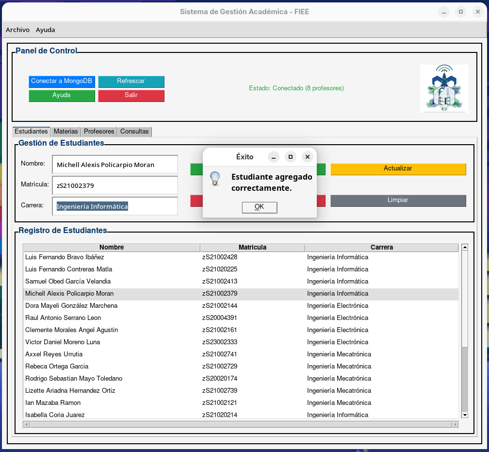
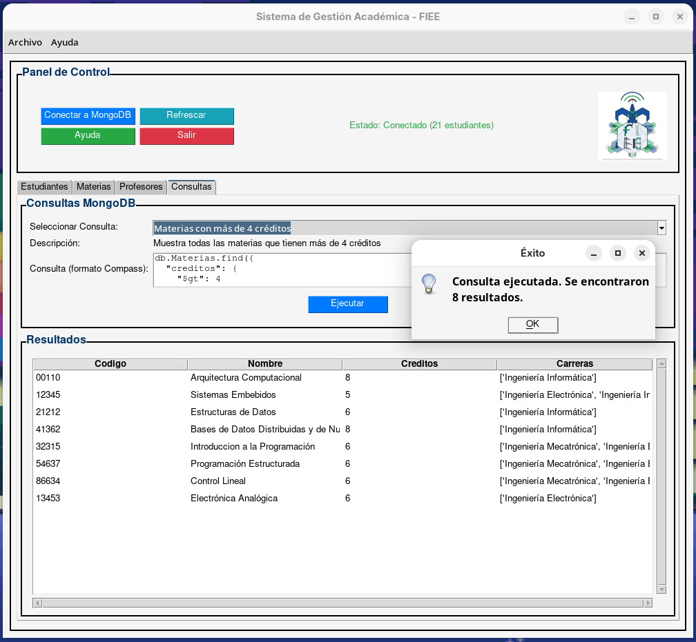

# 🎓 Sistema de Gestión Académica
## 📋 Descripción
El Sistema de Gestión Académica es una aplicación de escritorio desarrollada con Python y Tkinter que permite administrar información académica. La aplicación se conecta con MongoDB Atlas para almacenar y gestionar datos de estudiantes, materias y profesores.

## ✨ Características
- **🖥️ Interfaz gráfica intuitiva** con diseño moderno y responsivo
- **👨‍🎓 Gestión de estudiantes**: Registro, actualización y eliminación de datos estudiantiles
- **📚 Gestión de materias**: Administración del catálogo de cursos con créditos y carreras asociadas
- **👨‍🏫 Gestión de profesores**: Control del personal docente y sus datos de contacto
- **✅ Validación de datos**: Verificación automática de formatos (matrícula, email) y datos duplicados
- **☁️ Conexión a MongoDB Atlas**: Almacenamiento seguro en la nube

## 🔧 Requisitos
- Python 3.x
- Tkinter (incluido en la mayoría de instalaciones de Python)
- pymongo
- Pillow (PIL)

## 🚀 Instalación
1. Clona el repositorio:
```
git clone https://github.com/yourusername/sistema-gestion-academica-fie.git
```
2. Instala las dependencias:
```
pip install pymongo pillow
```
3. Coloca una imagen llamada "FIEE.png" en el directorio principal para el logo

## ⚙️ Configuración
El sistema está preconfigurado para conectarse a una base de datos MongoDB específica. Para cambiar esta configuración, modifica las siguientes variables al inicio del archivo:
```python
MONGO_URI = "tu_cadena_de_conexion_mongodb"
DATABASE_NAME = "nombre_de_tu_base_de_datos"
```

## 🖱️ Uso
1. Ejecuta la aplicación:
```
python main.py
```
2. Conecta la aplicación a MongoDB mediante el botón "Conectar a MongoDB"
3. Usa las diferentes pestañas para gestionar estudiantes, materias y profesores

## 📊 Estructura de datos
El sistema maneja tres colecciones principales:

### 👨‍🎓 Estudiantes (Alumnos)
- **nombre**: Nombre completo del estudiante
- **matricula**: Identificador único (formato: zSxxxxxxxx)
- **carrera**: Carrera en la que está inscrito

### 📚 Materias
- **codigo**: Código único de la materia
- **nombre**: Nombre de la asignatura
- **creditos**: Valor numérico de créditos
- **carreras**: Lista de carreras donde se imparte la materia

### 👨‍🏫 Profesores
- **nombre**: Nombre completo del profesor
- **licenciatura**: Título académico
- **email**: Correo electrónico institucional

## 📷 Capturas de pantalla
<div style="display: flex; justify-content: space-between;">
  
  
</div>

## 📜 Licencia
© 2024 Michell Alexis Policarpio Moran - Todos los derechos reservados

## 👤 Autor
- **Michell Alexis Policarpio Moran**
- **Matrícula**: zS21002379
- **Materia**: Base de Datos y en la Nube
- **Profesora**: Primavera Lucho Arguelles

## Agradecimientos
- Facultad de Ingeniería Eléctrica y Electrónica por el apoyo institucional
- MongoDB Atlas por proporcionar servicios de base de datos en la nube
